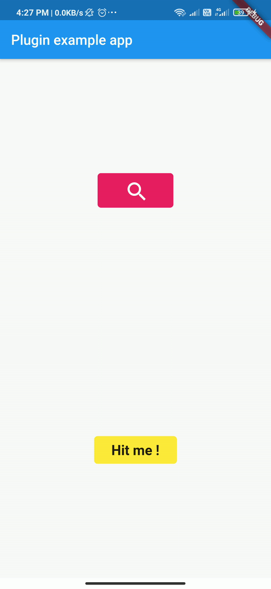
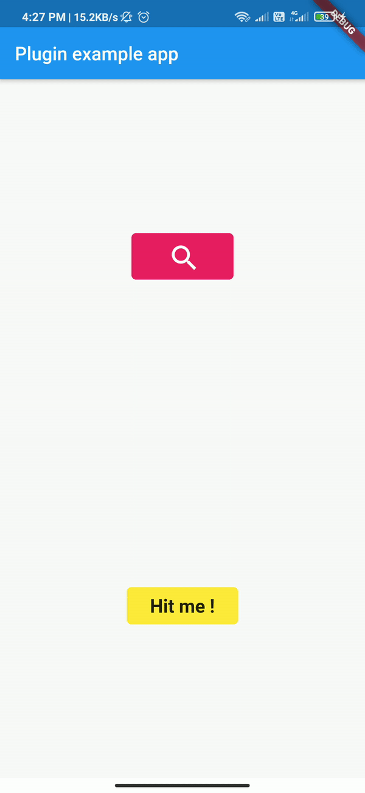

# touch_ripple_effect

A new flutter package for any flutter widgets to add touch ripple effect and touch feedback.

## find package on [pub.dev](https://pub.dev/packages?q=touch_ripple_effect)

## demo of TouchRippleEffect Widget in search icon Button



## demo of TouchFeedback Widget in Hit me button



## Getting Started

1 ) open pubspec.yaml file in project dir and write [touch_ripple_effect:](https://github.com/presswink/flutter_touch_ripple_effect) at below cupertino_icons.

pubspec.yaml:

```bash
touch_ripple_effect: 3.0.0
```

2 ) open command prompt in project dir and run

Command Line:

```bash
flutter pub get
```

## properties of TouchRippleEffect Widget

| properties      | details                                                                    | default value    | required |
|-----------------|----------------------------------------------------------------------------|------------------|----------|
| width           | TouchRippleEffect widget width size                                        | null             | false    |
| height          | TouchRippleEffect widget height size                                       | null             | false    |
| child           | child widget in which you want to apply Touch Ripple effect                | null             | true     |
| rippleColor     | color that's you want to see as a ripple effect                            | null             | true     |
| onTap           | Listen onTap or click of child Widget  (note: either onTap or onLongPress) | null             | false    |
| awaitAnimation  | Await the animation to complete onTap                                      | true             | false    |
| rippleDuration  | how much time take to display ripple effect                                | 300 milliseconds | false    |
| backgroundColor | background color of TouchRippleEffect                                      | transparent      | false    |
| borderRadius    | border radius of TouchRippleEffect widget                                  | null             | false    |
| shadow          | add shadow to ripple widget                                                | null             | false    |
| onLongPress     | will handle widget long press (note: either onTap or onLongPress)          | null             | false    |

## properties of TouchFeedback Widget

| properties       | details                                                     | default value    | required |
|------------------|-------------------------------------------------------------|------------------|----------|
| child            | child widget in which you want to apply Touch Ripple effect | null             | true     |
| rippleColor      | color that's you want to see as a ripple effect             | null             | true     |
| onTap            | Listen onTap or click of child Widget                       | null             | false    |
| feedbackDuration | how much time take to display ripple effect                 | 300 milliseconds | false    |
| backgroundColor  | background color of TouchRippleEffect                       | transparent      | false    |
| borderRadius     | border radius of TouchRippleEffect widget                   | null             | false    |


## Examples
- TouchRippleEffect
```dart
import 'package:flutter/material.dart';
import 'package:touch_ripple_effect/touch_ripple_effect.dart';

void main() {
  runApp(const MyApp());
}

class MyApp extends StatefulWidget {
  const MyApp({super.key});

  @override
  _MyAppState createState() => _MyAppState();
}

class _MyAppState extends State<MyApp> {
  var _helloRadius = BorderRadius.circular(5);

  @override
  Widget build(BuildContext context) {
    return MaterialApp(
      home: Scaffold(
          body: Container(
        alignment: Alignment.center,
        child: Column(
          mainAxisAlignment: MainAxisAlignment.spaceAround,
          crossAxisAlignment: CrossAxisAlignment.center,
          textDirection: TextDirection.ltr,
          children: [
            // touch ripple effect implemented

            TouchRippleEffect(
                borderRadius: _helloRadius,
                rippleColor: Colors.white60,
                onTap: () {
                  print("adi !");
                },
                child: Container(
                  width: 110,
                  height: 50,
                  alignment: Alignment.center,
                  decoration: BoxDecoration(
                      color: Colors.pink, borderRadius: _helloRadius),
                  child: Text("On Click", style: TextStyle(fontSize: 18, fontWeight: FontWeight.bold, color: Colors.white),),
                )),

            // longPress button

            TouchRippleEffect(
                borderRadius: _helloRadius,
                rippleColor: Colors.white60,
                onLongPress: () {
                  print("adi !");
                },
                child: Container(
                  width: 110,
                  height: 50,
                  alignment: Alignment.center,
                  decoration: BoxDecoration(
                      color: Colors.pink, borderRadius: _helloRadius),
                  child: Text("LongPress", style: TextStyle(fontSize: 18, fontWeight: FontWeight.bold, color: Colors.white),),
                )
            ),

            // longPress button

            TouchRippleEffect(
              shadow: [
                BoxShadow(color: Colors.grey, blurRadius: 3, offset: Offset(3, 3))
              ],
                borderRadius: _helloRadius,
                rippleColor: Colors.white60,
                onTap: () {
                  print("adi !");
                },
                child: Container(
                  width: 110,
                  height: 50,
                  alignment: Alignment.center,
                  decoration: BoxDecoration(
                      color: Colors.pink, borderRadius: _helloRadius),
                  child: Text("shadow", style: TextStyle(fontSize: 18, fontWeight: FontWeight.bold, color: Colors.white),),
                )
            ),
          ],
        ),
      )),
    );
  }
}
```


- TouchFeedback
```dart
import 'package:flutter/material.dart';
import 'package:touch_ripple_effect/touch_ripple_effect.dart';

void main() {
  runApp(const MyApp());
}

class MyApp extends StatefulWidget {
  const MyApp({super.key});

  @override
  _MyAppState createState() => _MyAppState();
}

class _MyAppState extends State<MyApp> {
  var _helloRadius = BorderRadius.circular(5);

  @override
  Widget build(BuildContext context) {
    return MaterialApp(
      home: Scaffold(
          body: Container(
        alignment: Alignment.center,
        child: Column(
          mainAxisAlignment: MainAxisAlignment.spaceAround,
          crossAxisAlignment: CrossAxisAlignment.center,
          textDirection: TextDirection.ltr,
          children: [
            // touch Feedback effect implemented.
            TouchFeedback(
              onTap: () {
                print(" I am Aditya");
              },
              rippleColor: Colors.blue[200],
              child: Container(
                  width: 120,
                  height: 40,
                  alignment: Alignment.center,
                  decoration: BoxDecoration(
                    color: Colors.yellow,
                    borderRadius: BorderRadius.circular(5),
                  ),
                  child: Text("Hit me !",
                      style: TextStyle(
                          fontSize: 20, fontWeight: FontWeight.bold))),
            )
          ],
        ),
      )),
    );
  }
}
```

## Contributor
[@Adityapanther](https://github.com/Adityapanther/)
[@matejhocevar](https://github.com/matejhocevar)
